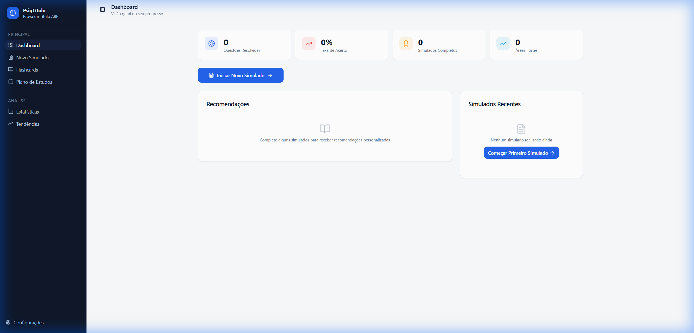
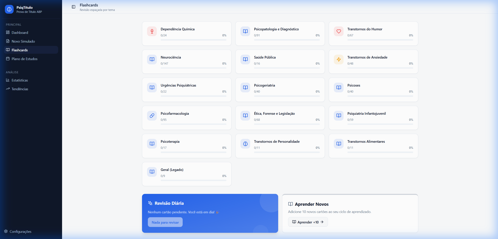
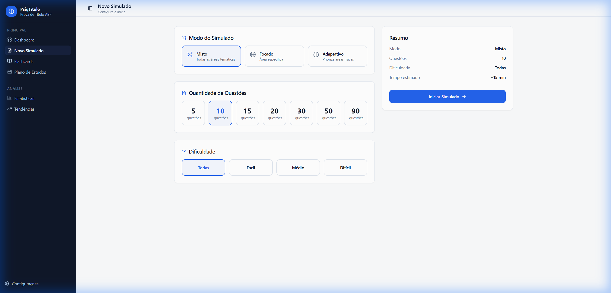

# PsiqTítulo - Estudos para Prova de Título em Psiquiatria



Aplicação web moderna e responsiva (PWA) desenvolvida para auxiliar candidatos na preparação para a Prova de Título de Especialista em Psiquiatria (ABP). Oferece simulados personalizados, flashcards com sistema de repetição espaçada (SRS) e análises detalhadas de desempenho.

## 🚀 Funcionalidades

- **📊 Dashboard Interativo**: Visão geral do progresso, últimas atividades e recomendações personalizadas.
- **📝 Simulados Personalizados**:
  - Modos: Misto (aleatório), Focado (por tema) e Adaptativo (foca nas fraquezas).
  - Configuração de dificuldade e quantidade de questões.
- **🧠 Flashcards SRS**:
  - Sistema de revisão espaçada (Spaced Repetition System) para maximizar a retenção.
  - Organização por temas (ex: Psicofarmacologia, Transtornos de Humor).
- **📈 Análises e Estatísticas**:
  - Gráficos de evolução temporal e desempenho por área temática.
  - Identificação automática de pontos fortes e fracos.
- **📅 Plano de Estudos Inteligente**: Recomendações automáticas baseadas no desempenho nos simulados.
- **🔍 Tendências da Prova**: Análise histórica de temas mais cobrados nas provas anteriores.

## 📸 Screenshots

| Dashboard | Flashcards | Novo Simulado |
|:---:|:---:|:---:|
|  |  |  |

## 🛠️ Tecnologias Utilizadas

- **Frontend**: [React](https://react.dev/), [TypeScript](https://www.typescriptlang.org/), [Vite](https://vitejs.dev/)
- **Estilização**: [Tailwind CSS](https://tailwindcss.com/), [shadcn/ui](https://ui.shadcn.com/)
- **Gerenciamento de Estado**: [Zustand](https://github.com/pmndrs/zustand)
- **Visualização de Dados**: [Recharts](https://recharts.org/)
- **Ícones**: [Lucide React](https://lucide.dev/)
- **Armazenamento**: LocalStorage (Persistência local dos dados de progresso)

## 📦 Instalação e Execução

Pré-requisitos: Node.js (v18+)

```bash
# Clone o repositório
git clone https://github.com/seu-usuario/psiquiatria-titulo-app.git

# Instale as dependências
npm install

# Inicie o servidor de desenvolvimento
npm run dev
```

O app estará disponível em `http://localhost:3000`.

## 🏗️ Build para Produção

```bash
npm run build
# O resultado será gerado na pasta dist/
```
